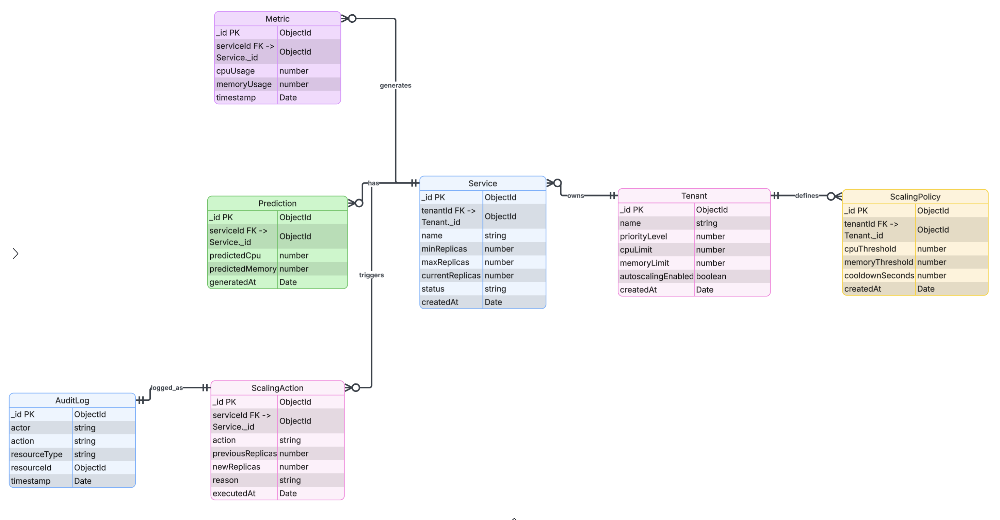

# Entity Relationship Diagram (ERD)

This schema models the **Multi-Tenant Resource Allocation System**, enforcing strict isolation between tenants while sharing underlying resources. It defines the core relationships between **Tenants**, their registered **Services**, and the high-volume **Metrics** streams that drive decision-making. Key entities include:

*   **Tenant & User:** Manages organization-level access and role-based permissions.
*   **Service & Policy:** specific configurations for how each microservice should handle load (e.g., CPU vs. Memory targets).
*   **Metrics & Logs:** The historical data foundation used/generated by the prediction engine for auditing and analysis.

