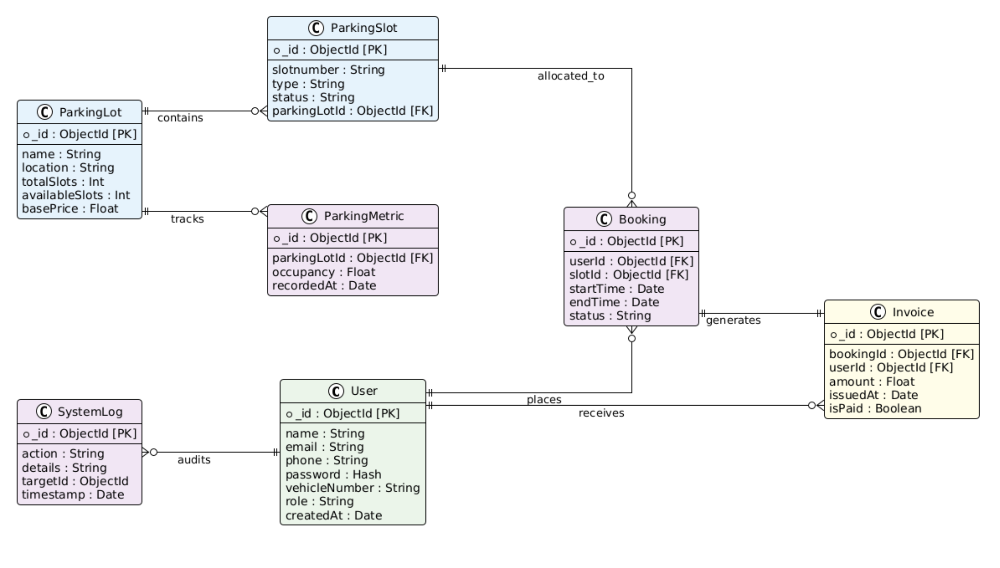

# Entity Relationship Diagram (ERD)

This schema models the **Smart Parking Space Allocation System**, enabling efficient tracking of parking resources, demand prediction, and dynamic allocation across multiple parking zones. It defines the core relationships between **Parking Lots**, their individual **Parking Slots**, and the continuous **Occupancy Metrics** that drive prediction and decision-making.

### Key Entities Include:

*   **ParkingLot & ParkingSlot:** Represents the hierarchical structure of parking infrastructure, where each parking lot contains multiple slots categorized by type (general, premium, EV). This ensures organized tracking and allocation of spaces.
*   **ParkingSlot & Allocation:** Captures the real-time status of each slot (occupied, free, reserved) and records allocation actions when a slot is assigned or reserved for incoming vehicles.
*   **ParkingMetrics & Predictions:** Stores historical occupancy data and predicted demand values, forming the foundation for the prediction engine to forecast peak usage and optimize allocation strategies.
*   **AllocationLogs:** Maintains a record of all system decisions (e.g., reservation, redirection), ensuring traceability, auditing, and performance analysis.
*   **User (Optional - Admin):** Manages system access, allowing administrators to monitor parking operations, configure rules, and view analytics dashboards.

