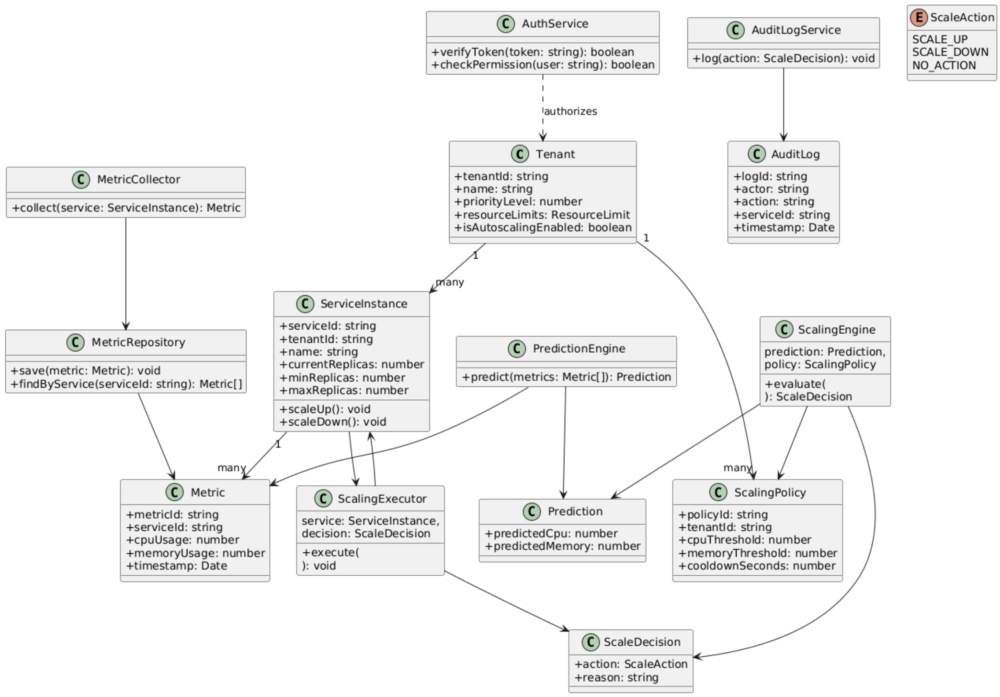

# Class Diagram

This diagram visualizes the **Object-Oriented Architecture** of the Prediction & Scaling Engine. It leverages design patterns to ensure the system is extensible and maintainable in a production environment:

*   **Strategy Pattern:** Allows hot-swapping of predictive algorithms (e.g., `LinearRegression` vs. `MovingAverage`) without altering core logic.
*   **Observer Pattern:** Enables the `PredictionEngine` to react continuously to incoming `Metric` streams in real-time.
*   **Factory/Interface:** Decouples the `ScalingExecutor` from specific infrastructure implementations, making it easier to support multiple cloud providers.

