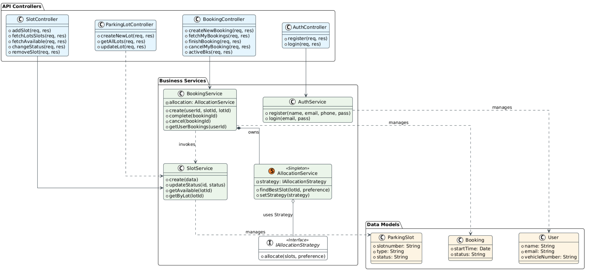

# Class Diagram

This diagram visualizes the **Object-Oriented Architecture** of the Prediction & Scaling Engine. It leverages design patterns to ensure the system is extensible and maintainable in a production environment:

*   **Strategy Pattern:** Allows hot-swapping of predictive algorithms (e.g., `LinearRegression` vs. `MovingAverage`) without altering core logic.
*   **Observer Pattern:** Enables the `PredictionEngine` to react continuously to incoming `Metric` streams in real-time.
*   **Factory/Interface:** Decouples the `ScalingExecutor` from specific infrastructure implementations, making it easier to support multiple cloud providers.

*   **3-Tier Architecture:** Explicit separation between **API Controllers** (Request handling), **Business Services** (Logic orchestration), and **Data Models** (Database schemas).
*   **Strategy Pattern:** The `AllocationService` leverages the Strategy Pattern to switch between `NormalAllocation` and `PeakHourAllocation` logic dynamically based on system demand.
*   **Observer Pattern:** Enables the `MonitoringService` to react in real-time to updates from the `OccupancyTracker`, triggering notifications when facility thresholds are reached.
*   **Factory Pattern:** Decouples the `AllocationEngine` from specific strategy instances, allowing the system to instantiate the correct allocation logic based on real-time traffic conditions.
*   **Singleton Pattern:** The `AllocationService` and `DatabaseConnection` are implemented as Singletons to maintain a single source of truth across the application.
*   **Encapsulation:** Core business rules are encapsulated within services, ensuring that the API layer remains thin and logic-free.

