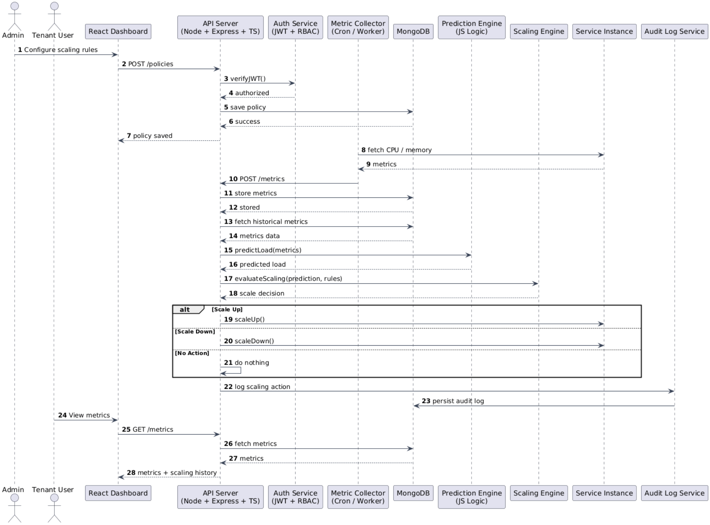

# Sequence Diagram

This flow illustrates the **Predictive Auto-Scaling Loop**, detailing how the system transitions from monitoring to action. It highlights the asynchronous nature of the analysis pipeline to prevent blocking critical operations:

1.  **Ingestion:** The `Monitoring Agent` continuously pushes resource metrics to the `TimeSeries API`.
2.  **Analysis:** The `Prediction Engine` processes historical data to forecast future load trends.
3.  **Execution:** If a threshold is breached, the `Executor` triggers a scale-out/in event and logs the action for auditability.

