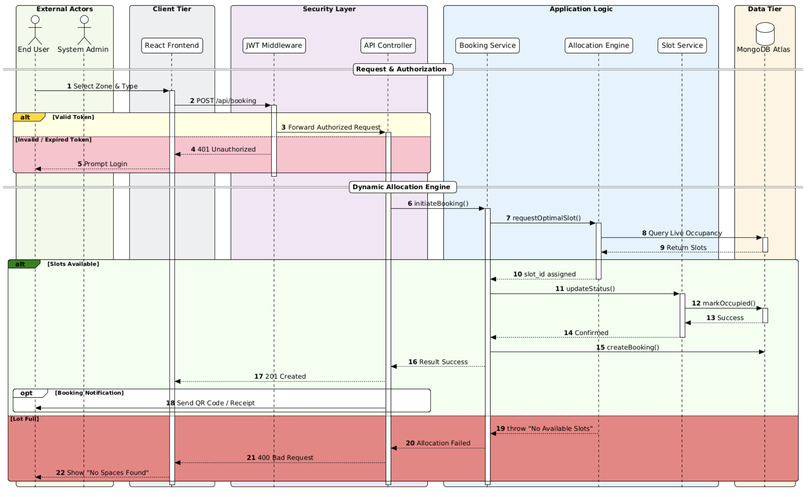

# Sequence Diagram

This flow illustrates the **Smart Parking Allocation Loop**, detailing how the system transitions from real-time occupancy tracking to predictive decision-making and slot allocation. It highlights the event-driven nature of the pipeline to ensure responsive and efficient parking management:

1.  **Ingestion:** The `Occupancy Tracker` continuously receives updates (slot occupied/free) and pushes parking metrics to the system.
2.  **Analysis:** The `Prediction Engine` processes historical occupancy data to forecast future parking demand and detect potential peak conditions.
3.  **Execution:** If predicted occupancy crosses defined thresholds, the `Decision Engine` triggers the `Allocation Engine` to reserve slots, restrict access, or redirect incoming vehicles. All actions are logged for auditability and monitoring.

1.  **Security & Authentication:** Every request is intercepted by the **JWT Middleware** to verify identity and role permissions before reaching the controllers.
2.  **Intelligent Allocation:** The **Booking Service** delegates slot selection to the **Allocation Engine**, which runs complex logic to find the optimal space in real-time.
3.  **State Persistence:** The **Slot Service** handles atomicity, ensuring that a slot is marked as 'occupied' in the database before the booking is finalized to prevent race conditions.
4.  **Admin Oversight:** Shows the separate privileged path where administrators can initialize new facilities and monitor system-wide state changes.

