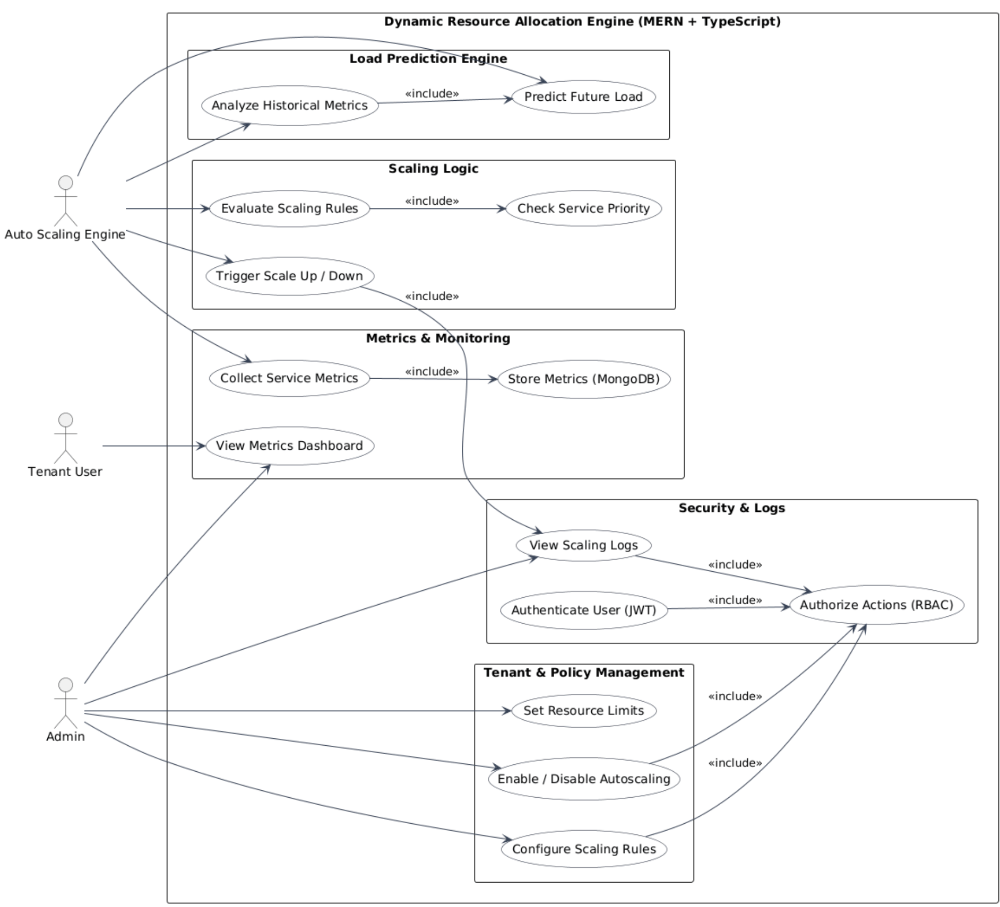

# Use Case Diagram

This diagram outlines the **Functional Requirements** and key interactions for the AutoScaleX platform. It categorizes system capabilities by actor to ensure all stakeholder needs are met:

*   **System Admin:** Manages the platform infrastructure, global configurations, and tenant onboarding.
*   **Tenant User:** Configures specific scaling policies for their services and views performance dashboards.
*   **System Scheduler:** Background processes that drive the automated prediction and resource optimization cycles.

