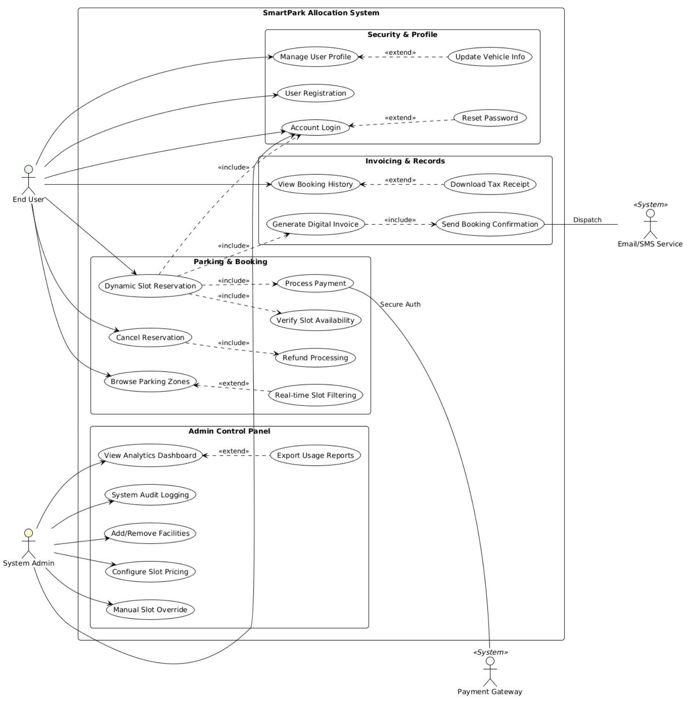

# Use Case Diagram

This diagram outlines the **Functional Requirements** and key interactions for the Smart Parking Space Allocation System. It categorizes system capabilities by actor to ensure efficient parking management and optimal user experience:

*   **Parking Admin:** Manages parking infrastructure, configures parking zones, defines allocation rules, and monitors real-time occupancy and system performance.
*   **Driver (End User):** Requests parking slots, views availability, and receives slot allocation or redirection based on current demand and system decisions.
*   **System Scheduler:** Background processes that continuously collect occupancy data, trigger prediction cycles, and execute automated allocation or redirection actions.

*   **End User:** Interacts with the platform to manage their profile, browse facilities, and execute the full booking-to-invoice lifecycle.
*   **System Admin:** Possesses elevated privileges to manage physical infrastructure, configure pricing rules, and access system-wide analytics.
*   **External Systems:** Interfaces with **Payment Gateways** for transaction processing and **Notification Services** for user alerts.

### Functional Groupings:

*   **Parking Operations:** Covers the primary logic of finding, reserving, and paying for slots.
*   **Administrative Control:** Includes high-level management tasks like "Manual Slot Override" and "Exporting Usage Reports."
*   **Financial Flow:** Explicitly models the relationship between Booking, Payment Processing, and Digital Invoicing.

